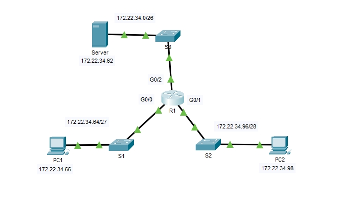
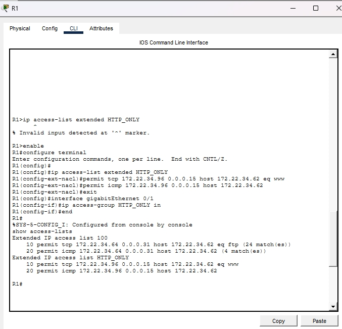

# 🛡️ Implementación de Seguridad de Red: ACLs Extendidas en Cisco IOS

**Autor:** Luz Maria Talavera Martinez  
**Fecha:** 13 de abril de 2026  
**Especialidad:** Defensa de Redes / Ciberseguridad

---

## 📌 Resumen del Proyecto
Este proyecto demuestra la implementación práctica de políticas de seguridad perimetral utilizando un Router Cisco R1. El objetivo principal es aplicar el **Principio de Menor Privilegio (PoLP)** para segmentar el tráfico de red y proteger servicios críticos.

## 📐 Topología de la Red

*Diseño de infraestructura con segmentación de subredes para PC1, PC2 y Servidor.*

---

## 🛠️ Detalles de la Implementación

### 1. Control de Acceso PC1 (Segmento Finanzas)
Se configuró una **ACL Extendida Numerada (100)** para restringir el tráfico:
- **Permitido:** FTP (puerto 21) e ICMP (Ping) hacia el Servidor.
- **Denegado:** Cualquier otro tráfico hacia otros segmentos de la red.

### 2. Control de Acceso PC2 (Segmento Administrativo)
Se implementó una **ACL Extendida con Nombre (HTTP_ONLY)**:
- **Permitido:** Tráfico Web (puerto 80) e ICMP (Ping) hacia el Servidor.
- **Denegado:** Acceso a servicios de archivos (FTP) y otras redes.

---

## 📊 Validación y Resultados
La configuración fue verificada exitosamente mediante pruebas de conectividad directa y auditoría de la tabla de acceso en el router:

*Captura de la CLI de R1 mostrando los "matches" de paquetes, lo que confirma la efectividad de las reglas aplicadas.*

---

## 📋 Habilidades Técnicas Destacadas
- **Cisco IOS CLI**: Configuración avanzada en modo global e interfaz.
- **Seguridad Perimetral**: Filtrado de tráfico en Capa 4 (TCP) y Capa 3 (IP).
- **Cálculo de Máscaras Wildcard**: Precisión en el direccionamiento para subredes `/27` y `/28`.
- **Análisis de Conectividad**: Resolución de problemas y verificación de flujo de datos.

---
## 🤖 Colaboración y Mentoría
Este laboratorio fue desarrollado con el apoyo de **IA (Google Gemini)** como mentor técnico. La IA guio el proceso de:
- Configuración de sintaxis en Cisco IOS.
- Cálculo de Wildcard Masks.
- Documentación del proyecto y despliegue del repositorio mediante Git/PowerShell.

---
*Este laboratorio ha sido completado como parte de mi formación técnica en Defensa de Redes.*
